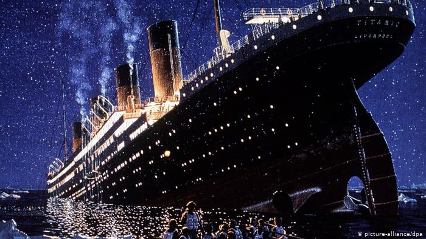

# Titanic Deep Learning from Disaster



> Using Deep learning model to solve kaggle Titanic: Machine Learning from Disaster problem

---

### Table of Contents

- [Description](#description)
- [How To Use](#how-to-use)
- [References](#references)
- [License](#license)
- [Author Info](#author-info)

---

## Description

Solving the Titanic: Machine Learning from Disaster problem using Tensorflow Deep Neural network architecture. This is a Regression problem. the model is trained on the train dataset with validation split ratio is 20%. After the training process, the test data is used to predict the survival and a submission file is created which has to be submitted to Kaggle compition. The accuracy was around 77%.

#### Technologies

- Tensorflow 2.2
- Python 3.7

[Back To The Top](#Titanic-Deep-Learning-from-Disaster)

---

## How To Use
### Install Jupyter notebook
[ [Install-jupyter-notebook](https://jupyter.org/install)]

### Download the data set from [Kaggle](https://www.kaggle.com/c/titanic/data)

## So now our project folder contains this file structure:
~~~
  ├── .gitignore
  ├── train.csv
  ├── test.csv
  └── regression.ipynb
~~~

### run this command in Command prompt

```
    jupyter notebook regression.ipynb
```
[Back To The Top](#Titanic-Deep-Learning-from-Disaster)

---

## References

- problem statement - https://www.kaggle.com/c/titanic
- Preprocessing - https://github.com/porvakanti/Kaggle-Competition-TitanicSurvival
- Deep learning model - https://www.tensorflow.org/tutorials/keras/regression

[Back To The Top](#Titanic-Deep-Learning-from-Disaster)

---

## License

MIT License

Copyright (c) [2020] [Medhaja H L]

Permission is hereby granted, free of charge, to any person obtaining a copy
of this software and associated documentation files (the "Software"), to deal
in the Software without restriction, including without limitation the rights
to use, copy, modify, merge, publish, distribute, sublicense, and/or sell
copies of the Software, and to permit persons to whom the Software is
furnished to do so, subject to the following conditions:

The above copyright notice and this permission notice shall be included in all
copies or substantial portions of the Software.

THE SOFTWARE IS PROVIDED "AS IS", WITHOUT WARRANTY OF ANY KIND, EXPRESS OR
IMPLIED, INCLUDING BUT NOT LIMITED TO THE WARRANTIES OF MERCHANTABILITY,
FITNESS FOR A PARTICULAR PURPOSE AND NONINFRINGEMENT. IN NO EVENT SHALL THE
AUTHORS OR COPYRIGHT HOLDERS BE LIABLE FOR ANY CLAIM, DAMAGES OR OTHER
LIABILITY, WHETHER IN AN ACTION OF CONTRACT, TORT OR OTHERWISE, ARISING FROM,
OUT OF OR IN CONNECTION WITH THE SOFTWARE OR THE USE OR OTHER DEALINGS IN THE
SOFTWARE.

[Back To The Top](#Titanic-Deep-Learning-from-Disaster)

---

## Author Info

- LinkedIn - [medhaja](https://www.linkedin.com/in/medhaja/)
- Website - [Medhaja H L](https://medhaja.github.io/cv/)

[Back To The Top](#Titanic-Deep-Learning-from-Disaster)

[](http://hits.dwyl.com/medhaja/Kaggle-Titanic-Deep-Learning-from-Disaster)
